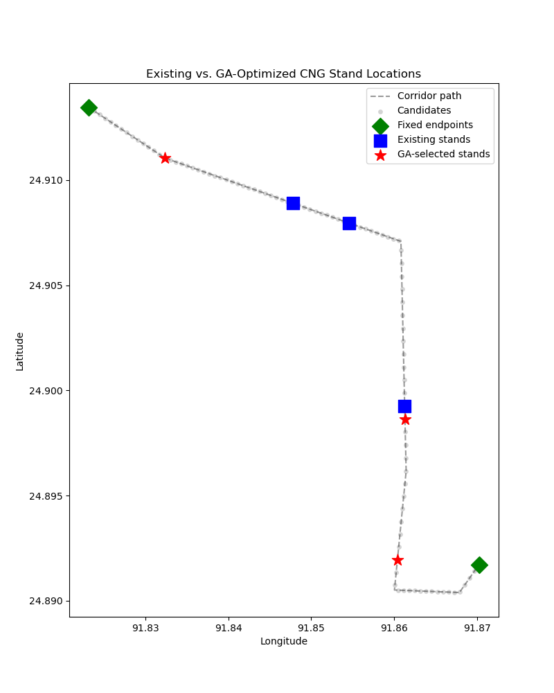

# cng_stand_location_optimization_using_AHP-GA
# CNG Stand Placement Optimization — Sylhet (Temuki–Bondor Bazar Corridor)

This project uses AHP (Analytic Hierarchy Process) + a Genetic Algorithm to evaluate whether the existing CNG auto-rickshaw stands along a real Sylhet corridor are well-placed, or whether better locations exist nearby.

**Corridor:** Temuki to Bondor Bazar
**Fixed endpoints:** Temuki, Bondor Bazar
**Flexible stands re-evaluated:** Modina Market, Pathantula, Rikabi Bazar

## Real Data Used

- **9 landmarks** (schools, hospital, bus stand) + 2 markets added manually (Modina Market, Bondor Bazar Market) — GPS coordinates from Google Maps
- **5 corridor path points** tracing the road (Sust, Subidbazar, Lama Bazar, Jitu Miya, Kin Bridge)
- **5 existing CNG stand locations** (Temuki, Modina Market, Pathantula, Rikabi Bazar, Bondor Bazar)
- **8 real junction points** (Kin Bridge, Taltola, Jitu Miya, Lama Bazar, Rikabi Bazar, Subid Bazar, Pathantula, Modina Market junctions)
- **9 cost-tier anchor points**, tiered High / Medium / Low with relative multipliers 2.75x / 1.5x / 1.0x

All datasets included as Excel/CSV files in this repo.

## Method

1. **AHP** — 4 criteria (Demand, Cost, Road Width, Junction Proximity), independently judged pairwise comparisons, weights via eigenvector method (CR = 0.0292, consistent)
2. **Candidate generation** — 100 points spaced along the real corridor path (Haversine distance + linear interpolation)
3. **Scoring** — Demand (landmark proximity, exponential decay), Junction Proximity (real junction distances), Road Width (two-tier segment model), Cost (tiered anchor proximity)
4. **Genetic Algorithm** — selects the best 3 flexible stand locations, with hard constraints: minimum 400m spacing between stands, minimum 75m clearance from junctions

## Key Finding

The GA confirmed Rikabi Bazar's placement as near-optimal (nearest GA alternative only 69m away), despite it having the lowest baseline AHP score among existing stands — suggesting its low score reflects a genuine geographic constraint, not poor siting. Modina Market and Pathantula each had GA-suggested alternatives located over 1.2km away, indicating potential relocation opportunities.

## Tools

Python — Pandas, NumPy, Matplotlib

## Limitations

Demand and Cost are proximity-based proxies, not measured ridership/land-valuation data. Road Width uses a simplified two-tier model, not a field survey. Junction Proximity simplifies a non-monotonic safety relationship into "closer is better." This is a methodology demonstration, not a deployment-ready planning recommendation.
